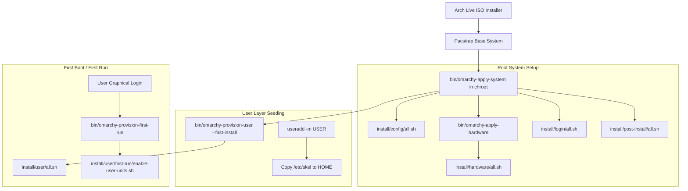
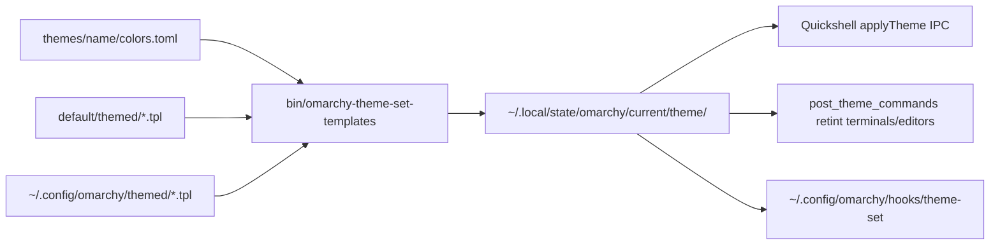

# Repository Map: Effie OS / Omarchy

This document provides a comprehensive architectural map of the Omarchy / Effie OS codebase, detailing the build and ISO creation pipeline, default configuration files, package manifests, branding assets, key system entry points, and extension hook locations.

---

## 1. Mental Model & Packaging Pipeline

The repository contains the complete userland, system configuration templates, desktop environment, installer hooks, and command tooling for Omarchy / Effie OS.

### Binary Packages Built From This Repository

While PKGBUILD recipes live in the packaging repository (`omarchy-pkgs`), this repository builds into two primary Arch packages:

1. **`omarchy-settings`** (Pre-installation & System Roots)
  - Must exist on the target system *before* user creation (`useradd -m`) and bootloader setup.
  - Seeds `/etc/skel/` (from [`config/`](file:///d:/effie-os/config) and [`applications/`](file:///d:/effie-os/applications)).
  - Contains `/etc/` drop-ins ([`etc/`](file:///d:/effie-os/etc)), upstream `/etc` overrides, package-owned files in `/usr/lib/` and `/usr/share/` ([`default/`](file:///d:/effie-os/default)), custom fonts, plymouth themes, SDDM themes, branding assets, and Limine/Snapper configs.
  - Ships live ISO debug utilities: [`bin/omarchy-debug`](file:///d:/effie-os/bin/omarchy-debug), [`bin/omarchy-debug-idle`](file:///d:/effie-os/bin/omarchy-debug-idle), and [`bin/omarchy-upload-log`](file:///d:/effie-os/bin/omarchy-upload-log).

2. **`omarchy`** (Runtime & Desktop Shell)
  - Depends on `omarchy-settings`.
  - Ships runtime commands in [`bin/`](file:///d:/effie-os/bin) (installed to `/usr/bin/` and symlinked to `/usr/share/omarchy/bin/`).
  - Ships installation and setup scripts in [`install/`](file:///d:/effie-os/install) (installed to `/usr/share/omarchy/install/`).
  - Ships per-user migrations in [`migrations/`](file:///d:/effie-os/migrations) (installed to `/usr/share/omarchy/migrations/`).
  - Ships stock themes in [`themes/`](file:///d:/effie-os/themes) (installed to `/usr/share/omarchy/themes/`).
  - Ships the Quickshell desktop UI in [`shell/`](file:///d:/effie-os/shell) (installed to `/usr/share/omarchy/shell/`).
  - Ships ALPM transaction hooks in [`default/libalpm/hooks/`](file:///d:/effie-os/default/libalpm/hooks).

```
Repo Source                          Package Target       Installed Destination
──────────────────────────────────   ──────────────────   ──────────────────────────────────────────────────
bin/omarchy-*                        omarchy              /usr/bin/omarchy-* & /usr/share/omarchy/bin/
bin/omarchy-debug*                   omarchy-settings     /usr/bin/omarchy-debug*
config/**                            omarchy-settings     /etc/skel/.config/** & /usr/share/omarchy/config/**
applications/*.desktop               omarchy-settings     /etc/skel/.local/share/applications/
applications/icons/*                 omarchy-settings     /usr/share/icons/hicolor/{48,256,scalable}/apps/
etc/** (drop-ins)                    omarchy-settings     /etc/**
default/themed/*.tpl                 omarchy              /usr/share/omarchy/default/themed/
default/fonts/omarchy/omarchy.ttf    omarchy-settings     /usr/share/fonts/omarchy/omarchy.ttf
default/plymouth/                    omarchy-settings     /usr/share/plymouth/themes/omarchy/
default/sddm/                        omarchy-settings     /usr/share/sddm/themes/omarchy/
default/limine/                      omarchy-settings     /usr/share/omarchy/default/limine/
default/snapper/                     omarchy-settings     /etc/snapper/config-templates/omarchy
install/**                           omarchy              /usr/share/omarchy/install/
migrations/**                        omarchy              /usr/share/omarchy/migrations/
shell/**                             omarchy              /usr/share/omarchy/shell/
themes/**                            omarchy              /usr/share/omarchy/themes/
logo.*, icon.*                       omarchy-settings     /usr/share/pixmaps/, /usr/share/icons/, branding/
```

---

## 2. Target Installation & User Provisioning Pipeline

Installation proceeds through five coordinated layers from live ISO to first user desktop:



### 1. Root System Installation: [`bin/omarchy-apply-system`](file:///d:/effie-os/bin/omarchy-apply-system)
Executed by the installer inside the target chroot. Orchestrates:
- [`install/config/all.sh`](file:///d:/effie-os/install/config/all.sh): Configures firewall, Docker, Snapper retention, lockscreen PAM, SSH paths, power profiles, and enables systemd system units.
- [`bin/omarchy-apply-hardware`](file:///d:/effie-os/bin/omarchy-apply-hardware) & [`install/hardware/all.sh`](file:///d:/effie-os/install/hardware/all.sh): Auto-detects hardware vendors and models (Apple, Asus ROG/Zenbook, Dell XPS, Framework 16, Intel, Lenovo, Nvidia, Surface, Tuxedo) and installs modules, udev rules, and microcode.
- [`install/login/all.sh`](file:///d:/effie-os/install/login/all.sh): Configures SDDM display manager theme and Wayland session options.
- [`install/post-install/all.sh`](file:///d:/effie-os/install/post-install/all.sh): Executes final pacman, udev, and localdb hooks.

### 2. User Seeding & Finalization: [`bin/omarchy-provision-user`](file:///d:/effie-os/bin/omarchy-provision-user)
- **Static Seeding**: `useradd -m` copies `/etc/skel` (from `omarchy-settings`) into the user's `$HOME`.
- **Runtime Finalization**: `omarchy-provision-user` executes non-static user tasks:
  - Links AI assistant skills from [`default/agents/skills/`](file:///d:/effie-os/default/agents/skills) to `~/.agents/skills/`, `~/.claude/skills/`, `~/.codex/skills/`, `~/.gemini/config/skills/`, and `~/.pi/agent/skills/`.
  - Sets XDG user directories and GTK bookmarks.
  - Sourced [`install/user/all.sh`](file:///d:/effie-os/install/user/all.sh) (theme defaults, browser setup, git config, xcompose, mise toolchains, per-user audio/hardware fixes).
  - Marks pre-existing migrations as completed in `~/.local/state/omarchy/migrations/` on `--first-install`.

### 3. Factory / Deferred Provisioning: [`install/provisioning/`](file:///d:/effie-os/install/provisioning)
For OEM or deferred-provisioning images (`omarchy apply system --defer-provisioning`):
- Leaves `/var/lib/omarchy/provisioning/pending`.
- Arms [`install/provisioning/omarchy-provision-owner.service`](file:///d:/effie-os/install/provisioning/omarchy-provision-owner.service).
- Runs [`bin/omarchy-provision-owner`](file:///d:/effie-os/bin/omarchy-provision-owner) and [`install/provisioning/setup-form.sh`](file:///d:/effie-os/install/provisioning/setup-form.sh) on tty1 at first boot to create the primary user interactively.

### 4. Graphical First Run: [`bin/omarchy-provision-first-run`](file:///d:/effie-os/bin/omarchy-provision-first-run)
Runs once on first user login via graphical session target:
- Enables user systemd units via [`install/user/first-run/enable-user-units.sh`](file:///d:/effie-os/install/user/first-run/enable-user-units.sh) (`omarchy-sleep-lock`, `omarchy-migrate-notify`, `omarchy-fcitx5`, `omarchy-crash-watch`).
- Applies DConf/GNOME theme settings and speaker audio tuning.
- Emits desktop welcome notification toasts and Wi-Fi setup prompts.

### 5. Updates & Migrations: [`bin/omarchy-update`](file:///d:/effie-os/bin/omarchy-update) & [`bin/omarchy-migrate`](file:///d:/effie-os/bin/omarchy-migrate)
- `omarchy update` manages system snapshots (Snapper), cache pruning, pacman update transactions (guarded against raw `pacman -Syu` by [`bin/omarchy-update-pacman-guard`](file:///d:/effie-os/bin/omarchy-update-pacman-guard)), executes pending per-user migrations in [`migrations/`](file:///d:/effie-os/migrations), and restarts the shell.

---

## 3. Package Manifests & Default Configurations

### Package Manifests
- [`install/omarchy-base.packages`](file:///d:/effie-os/install/omarchy-base.packages): The core package list pacstrapped onto the root filesystem by the ISO installer (Hyprland, Quickshell, audio stack, foot, chromium, fcitx5, fonts, core CLI tools).
- [`install/omarchy-other.packages`](file:///d:/effie-os/install/omarchy-other.packages): Supplementary drivers, kernel headers, hardware support packages (Nvidia DKMS, Apple T2 packages, Intel drivers, Vulkan providers), and speaker tuning plugins.

### Default User Configurations ([`config/`](file:///d:/effie-os/config))
These populate `/etc/skel/.config/` and are copied to `$HOME/.config/` for new users:
- [`config/hypr/`](file:///d:/effie-os/config/hypr): Hyprland compositor settings, keybindings, animations, and monitor autostart.
- [`config/omarchy/shell.json`](file:///d:/effie-os/config/omarchy/shell.json): Quickshell configuration defining bar layout, widget positions, and idle timeout intervals.
- [`config/omarchy/extensions/`](file:///d:/effie-os/config/omarchy/extensions): User extensions point for the system menu ([`omarchy-menu.jsonc`](file:///d:/effie-os/config/omarchy/extensions/omarchy-menu.jsonc)).
- [`config/foot/`](file:///d:/effie-os/config/foot), [`config/alacritty/`](file:///d:/effie-os/config/alacritty), [`config/ghostty/`](file:///d:/effie-os/config/ghostty), [`config/kitty/`](file:///d:/effie-os/config/kitty): Terminal emulator configurations.
- [`config/btop/`](file:///d:/effie-os/config/btop), [`config/fcitx5/`](file:///d:/effie-os/config/fcitx5), [`config/git/`](file:///d:/effie-os/config/git), [`config/herdr/`](file:///d:/effie-os/config/herdr), [`config/lazygit/`](file:///d:/effie-os/config/lazygit), [`config/obsidian/`](file:///d:/effie-os/config/obsidian), [`config/opencode/`](file:///d:/effie-os/config/opencode), [`config/starship.toml`](file:///d:/effie-os/config/starship.toml), [`config/tmux/`](file:///d:/effie-os/config/tmux), [`config/wireplumber/`](file:///d:/effie-os/config/wireplumber), [`config/xournalpp/`](file:///d:/effie-os/config/xournalpp).

### System Defaults & Environment Bootstrap ([`default/`](file:///d:/effie-os/default))
- [`default/bash/env-bootstrap`](file:///d:/effie-os/default/bash/env-bootstrap): Single source of truth for `$OMARCHY_PATH`, development path routing (`omarchy-dev-link`), and mise shims. Sourced by `/etc/profile.d/omarchy.sh`, `~/.bashrc`, and UWSM session environment.
- [`default/omarchy/omarchy-menu.jsonc`](file:///d:/effie-os/default/omarchy/omarchy-menu.jsonc): Master definition of the desktop menu tree, actions, links, and shell condition guards.
- [`default/themed/`](file:///d:/effie-os/default/themed): Config templates populated with active theme palette tokens.

---

## 4. Branding & Visual Assets

- **Root Wordmark & Icons**:
  - [`logo.svg`](file:///d:/effie-os/logo.svg) & [`logo.txt`](file:///d:/effie-os/logo.txt): Vector and ASCII wordmarks.
  - [`icon.png`](file:///d:/effie-os/icon.png) & [`icon.txt`](file:///d:/effie-os/icon.txt): System icons.
- **Application Icons**: [`applications/icons/`](file:///d:/effie-os/applications/icons) (48x48, 256x256, and scalable vectors for core desktop apps).
- **Branded Font**: [`default/fonts/omarchy/omarchy.ttf`](file:///d:/effie-os/default/fonts/omarchy/omarchy.ttf): Custom icon font containing branded symbols and status glyphs used by the menu and desktop shell.
- **Boot Splash (Plymouth)**: [`default/plymouth/`](file:///d:/effie-os/default/plymouth) (`omarchy.plymouth`, `omarchy.script`, boot logos, progress indicators).
- **Display Manager (SDDM)**: [`default/sddm/`](file:///d:/effie-os/default/sddm) (SDDM theme assets and Hyprland greeter configuration).
- **ASCII Conversion Tools**:
  - [`bin/omarchy-transcode-ascii`](file:///d:/effie-os/bin/omarchy-transcode-ascii): Transcodes SVG/PNG images into Braille or block ASCII.
  - [`bin/omarchy-ascii`](file:///d:/effie-os/bin/omarchy-ascii): Generates Delta Corps Priest 1 FIGlet banners for screensavers and About dialogs.
  - Destination user files: `~/.config/omarchy/branding/screensaver.txt` and `~/.config/omarchy/branding/about.txt`.

---

## 5. Desktop Architecture & Theming Engine

### Desktop Shell: [`shell/`](file:///d:/effie-os/shell)
The desktop is powered by [Quickshell](https://quickshell.org/) hosted via [`shell/shell.qml`](file:///d:/effie-os/shell/shell.qml).
- **Bar & Panels**: Located in [`shell/plugins/bar/`](file:///d:/effie-os/shell/plugins/bar) and [`shell/plugins/panels/`](file:///d:/effie-os/shell/plugins/panels).
- **Menu System**: [`shell/plugins/menu/Menu.qml`](file:///d:/effie-os/shell/plugins/menu/Menu.qml) loads and renders [`default/omarchy/omarchy-menu.jsonc`](file:///d:/effie-os/default/omarchy/omarchy-menu.jsonc) overlaid with user extensions, evaluated via [`shell/plugins/menu/MenuModel.js`](file:///d:/effie-os/shell/plugins/menu/MenuModel.js).
- **Services & IPC**: Singletons in [`shell/services/`](file:///d:/effie-os/shell/services) receive IPC calls dispatched via [`bin/omarchy-shell`](file:///d:/effie-os/bin/omarchy-shell).
- **Plugin Architecture**: Third-party plugins install to `~/.config/omarchy/plugins/<id>/` with entry point manifests.

### Theming System & Dynamic Config Generation
Themes reside in [`themes/<theme-name>/`](file:///d:/effie-os/themes) (or user directory `~/.config/omarchy/themes/<theme-name>/`).



1. **Palette Definitions**: [`themes/<name>/colors.toml`](file:///d:/effie-os/themes/catppuccin/colors.toml) provides semantic colors (`accent`, `background`, `foreground`, `selection`, `muted`, `red`, `blue`, etc.).
2. **Template Processing**: [`bin/omarchy-theme-set-templates`](file:///d:/effie-os/bin/omarchy-theme-set-templates) parses [`default/themed/*.tpl`](file:///d:/effie-os/default/themed) and replaces placeholders (`{{ accent }}`, `{{ mix background foreground 20% }}`, `{{ hypr_gradient ... }}`).
3. **Template Registry**:
  - `shell.toml.tpl` -> Shell layout, borders, font scale, spacing.
  - `hyprland.lua.tpl` -> Hyprland border gradients and active colors.
  - `alacritty.toml.tpl`, `foot.ini.tpl`, `ghostty.conf.tpl`, `kitty.conf.tpl` -> Terminal color palettes.
  - `neovim.lua.tpl`, `helix.toml.tpl`, `vscode-theme.json.tpl` -> Editor color themes.
  - `btop.theme.tpl`, `obsidian.css.tpl`, `pi.json.tpl`, `claude.json.tpl`.
4. **Activation Flow**: [`bin/omarchy-theme-set`](file:///d:/effie-os/bin/omarchy-theme-set) builds a clean staging directory, renders templates, atomically swaps into `~/.local/state/omarchy/current/theme`, notifies the running shell via IPC, and dispatches parallel reload commands for open applications.

---

## 6. Extension & Customization Integration Points

| Feature | Where to Hook / Files to Touch |
|---|---|
| **Add New Base Package** | Add package name to [`install/omarchy-base.packages`](file:///d:/effie-os/install/omarchy-base.packages). |
| **Add Hardware / Driver Package** | Add package name to [`install/omarchy-other.packages`](file:///d:/effie-os/install/omarchy-other.packages). |
| **System-wide Setup Step** | Add script to `install/config/<step>.sh` and source in [`install/config/all.sh`](file:///d:/effie-os/install/config/all.sh). |
| **Hardware Quirks / Drivers** | Add detection logic to `install/hardware/<vendor>/` and wire into [`install/hardware/all.sh`](file:///d:/effie-os/install/hardware/all.sh). |
| **User Finalization Step** | Add script to `install/user/<step>.sh` and wire into [`install/user/all.sh`](file:///d:/effie-os/install/user/all.sh) or [`bin/omarchy-provision-user`](file:///d:/effie-os/bin/omarchy-provision-user). |
| **First-Login Setup Step** | Add script to `install/user/first-run/<step>.sh` and wire into [`bin/omarchy-provision-first-run`](file:///d:/effie-os/bin/omarchy-provision-first-run). |
| **Default User Config File** | Add default configuration to [`config/<app>/...`](file:///d:/effie-os/config) (automatically placed in `/etc/skel/.config/`). |
| **System Service Drop-in** | Add systemd unit to [`default/systemd/`](file:///d:/effie-os/default/systemd) and register in [`install/config/enable-services.sh`](file:///d:/effie-os/install/config/enable-services.sh). |
| **New Stock Theme** | Create [`themes/<theme-name>/`](file:///d:/effie-os/themes) with `colors.toml`, `backgrounds/`, `preview.png`, `preview-unlock.png`, and `unlock.png`. |
| **New App Theme Template** | Add template to [`default/themed/<app>.tpl`](file:///d:/effie-os/default/themed) and add retint command to `post_theme_commands` in [`bin/omarchy-theme-set`](file:///d:/effie-os/bin/omarchy-theme-set). |
| **User Theme Customization** | Place local themes in `~/.config/omarchy/themes/<name>/` or local templates in `~/.config/omarchy/themed/*.tpl`. |
| **User Theme Hook** | Place executable script at `~/.config/omarchy/hooks/theme-set` (receives theme name as `$1`). |
| **Desktop Menu Item** | Add entry, action, or provider to [`default/omarchy/omarchy-menu.jsonc`](file:///d:/effie-os/default/omarchy/omarchy-menu.jsonc). |
| **New User-facing CLI Command** | Add executable [`bin/omarchy-<group>-<name>`](file:///d:/effie-os/bin) with `# omarchy:summary=...` metadata in the first 80 lines and update `GROUP_DESCRIPTIONS` in [`bin/omarchy`](file:///d:/effie-os/bin/omarchy). |
| **System Upgrade Migration** | Add numbered script [`migrations/<unix-timestamp>.sh`](file:///d:/effie-os/migrations) (executed per-user via [`bin/omarchy-migrate`](file:///d:/effie-os/bin/omarchy-migrate)). |
| **Quickshell Bar/Panel Plugin** | Add plugin directory in `shell/plugins/<name>/` (built-in) or `~/.config/omarchy/plugins/<name>/` (user-installed) with `manifest.json`. |
