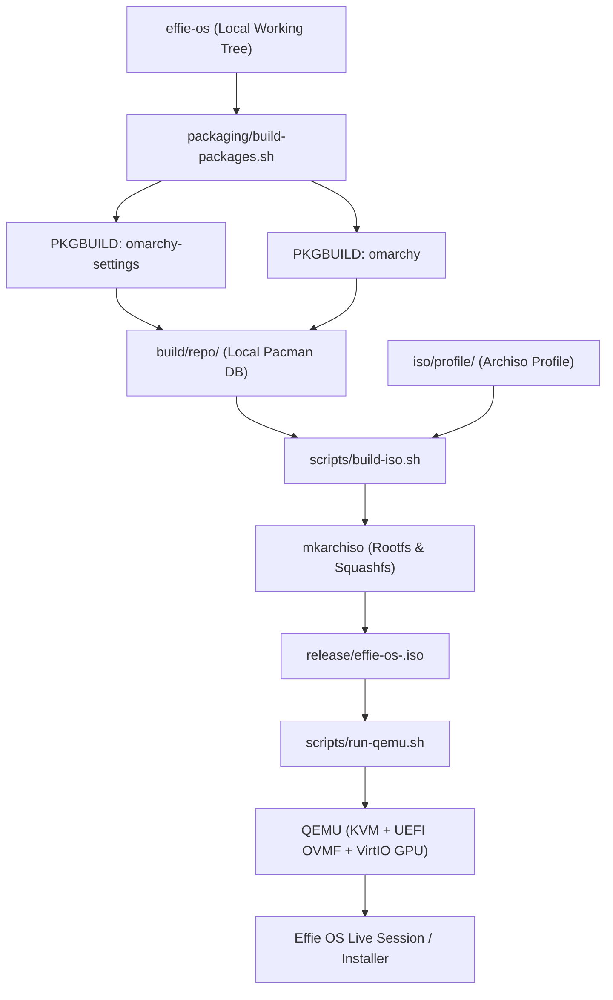

# Packaging, ISO Creation, and QEMU Testing Guide

This guide explains the architecture and operational workflow for building Arch packages from this repository, assembling a bootable Archiso image, and running fast test builds under QEMU with hardware acceleration.

---

## 1. Overview & Architecture



### Components

1. **Packaging (`packaging/`)**
   - **`omarchy-settings`**: Contains user skeletons (`/etc/skel/.config/**`), system `/etc` drop-ins, Plymouth boot splash, SDDM themes, system fonts, and pre-install debug binaries.
   - **`omarchy`**: Contains the runtime commands in `bin/`, ALPM transaction hooks, installation/finalization scripts in `install/`, stock themes in `themes/`, Quickshell desktop in `shell/`, and versioned migrations in `migrations/`.
   - **`build-packages.sh`**: Builds both packages directly from the local repo using `makepkg --nodeps` and indexes them into a local pacman repository database (`build/repo/effie-local.db.tar.zst`).

2. **Archiso Profile (`iso/profile/`)**
   - Configures the live ISO environment (`profiledef.sh`, `pacman.conf`, and `packages.x86_64`).
   - Configured with `[effie-local]` repository pointing to `build/repo/`, ensuring that code changes in your working tree are immediately reflected in the ISO without publishing to remote mirrors.

3. **ISO Builder (`scripts/build-iso.sh`)**
   - Automates pre-flight verification, package generation, archiso profile staging, `mkarchiso` execution, and SHA-256 checksumming.

4. **QEMU Test Harness (`scripts/run-qemu.sh`)**
   - Production-ready virtual machine runner with KVM acceleration, UEFI (OVMF) firmware, VirtIO GPU, sound, VirtIO network with SSH port forwarding, and support for ephemeral testing or persistent hard drives.

5. **Developer CLI (`scripts/effie-dev`)**
   - Single convenience utility for all workflows (`pkg`, `iso`, `qemu`, `test`, `clean`).

---

## 2. Quick Reference & Commands

| Task | Command | Description |
| :--- | :--- | :--- |
| **Build Packages** | `./scripts/effie-dev pkg` | Compiles local sources into Arch packages under `build/repo/` |
| **Build Full ISO** | `./scripts/effie-dev iso` | Builds packages and packages a bootable ISO under `release/` |
| **Clean Build ISO** | `./scripts/effie-dev iso --clean` | Cleans previous cache and runs a fresh full build |
| **Run in QEMU (Live)** | `./scripts/effie-dev qemu` | Boots the latest ISO in QEMU with KVM + UEFI + VirtIO GPU |
| **Test Disk Install** | `./scripts/effie-dev qemu --create-disk 30G` | Attaches a 30G virtual hard disk for testing installer workflows |
| **Boot Installed Disk** | `./scripts/effie-dev qemu --boot-disk -d build/effie-test-disk.qcow2` | Boots directly from the installed disk without the ISO |
| **Safe Ephemeral Test** | `./scripts/effie-dev qemu -d build/effie-test-disk.qcow2 --snapshot` | Discards all disk changes when the VM powers off |
| **SSH into VM** | `ssh -p 2222 root@localhost` | Connects to running guest over forwarded SSH port |
| **Run Unit Tests** | `./scripts/effie-dev test` | Runs the CLI and Shell test suites |
| **Clean Artifacts** | `./scripts/effie-dev clean` | Removes `build/` directory |

---

## 3. Detailed Workflows

### 3.1 Building Packages Only
If you are testing package contents or updating PKGBUILDs without re-generating a multi-gigabyte ISO:

```bash
./packaging/build-packages.sh
```

Built packages are placed in `build/repo/`:
- `omarchy-settings-<version>-any.pkg.tar.zst`
- `omarchy-<version>-any.pkg.tar.zst`
- `effie-local.db.tar.zst`

### 3.2 Building the ISO
To build the complete bootable live installer image:

```bash
./scripts/build-iso.sh
```

Output is saved to `release/effie-os-YYYY.MM.DD-x86_64.iso` along with its `.sha256` checksum.

### 3.3 Running and Debugging in QEMU

#### Live Session Testing
To boot into the live environment:

```bash
./scripts/run-qemu.sh
```

#### Installer & Hard Disk Testing
To simulate a real machine installation:
1. Create and attach a 30GB disk:
   ```bash
   ./scripts/run-qemu.sh --create-disk 30G
   ```
2. Inside the VM, run the installer or partitioning tools.
3. Once installation completes, boot directly from the installed virtual drive:
   ```bash
   ./scripts/run-qemu.sh --boot-disk -d build/effie-test-disk.qcow2
   ```

#### Remote SSH Access & Automated Testing
The QEMU harness forwards host port `2222` to the guest's port `22`:

```bash
# Connect directly from host terminal:
ssh -p 2222 root@localhost
```

---

## 4. Hardware Acceleration & VM Settings

* **KVM Acceleration**: Automatically enabled if `/dev/kvm` is accessible. Uses `-cpu host`.
* **UEFI Boot**: Uses OVMF firmware (`OVMF_CODE.4m.fd` and an isolated working copy of `OVMF_VARS.4m.fd`).
* **VirtIO GPU / Display**: Utilizes OpenGL-accelerated VirtIO GPU (`-device virtio-vga-gl -display sdl,gl=on`) when running in a graphical Wayland/X11 environment, with automatic fallback to standard VirtIO 2D.
* **Audio**: Connects Intel HDA to host PulseAudio/PipeWire.
* **Input**: Configured with USB Tablet device to ensure seamless mouse tracking without window capture locks.
